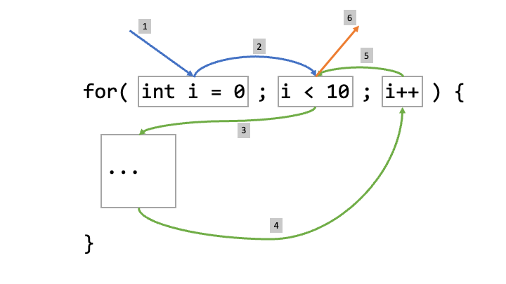

# 1. 反復処理

`foo()`という以下の機能が何回実行されるかを数えましょう。コードを書く必要はありません。実際に手を動かしてノートで計算してみてください。

_テーマ: ループ、for文_

# 1. Iterations

Calculate how many times will `foo()` be executed:

## a

```Java
for (int i = 0; i < 10; i++) {
  foo();
}
```

## b

```Java
int j;
for (j = 0; j < 7; j++) {
  foo();
}
```

## c

```Java
for (int i = 0; i < 10; i = i + 2) {
  foo();
}
```

## d

```Java
for (int i = 10; i > 1; i = i - 2) {
  foo();
}
```

## e

```Java
for (int i = 0, j = 10; i < 10 && j > 5; i++, j--) {
  foo();
}
```

## f

```Java
for (int i = 0; i < 10;) {
  foo();
}
```

## g

```Java
for (int i = 4; i < 20; i = 2 * i + 3) {
  foo();
}
```

## h

```Java
for (int i = 0; i < 10; i++) {
  for (int j = 0; j < 10; j++) {
    foo();
  }
}
```

<br/><br/>
<br/><br/>

# 2. 整数の表示

1から10までの整数を表示するプログラムを書いてください。数字と数字の間に「,」を表示させてください。

以下のように表示させてください：

```bash
1, 2, 3, 4, 5, 6, 7, 8, 9, 10
```

# 2. Display 1 to 10

Write a Java program to print the integers 1, 2, 3, ... 10.

Expected Output:

```bash
1, 2, 3, 4, 5, 6, 7, 8, 9, 10
```

<br/><br/>
<br/><br/>

# 3. 奇数の表示

1から11までの奇数を表示するプログラムを書いてください。数字と数字の間に「,」を表示させてください。

以下のように表示させてください：

```bash
1, 3, 5, 7, 9, 11
```

# 3. Display Odd Numbers

Write a Java program to print the odd numbers 1, 3, 5, ... 11.

Expected Output:

```bash
1, 3, 5, 7, 9, 11
```

<br/><br/>
<br/><br/>

# 4. 偶数の表示

2から10までの偶数を表示するプログラムを書いてください。数字と数字の間に「,」を表示させてください。

以下のように表示させてください：

```bash
2, 4, 6, 8, 10
```

# 4. Display Even Numbers

Write a Java program to print the odd numbers 2, 4, 6, ... 10.

Expected Output:

```bash
2, 4, 6, 8, 10
```

<br/><br/>
<br/><br/>

# 5. 3の倍数の表示

整数ｎが与えられたとき、3からnまでの3の倍数を表示するプログラムを書いてください。数字と数字の間に「,」を表示させてください。

代入する数字：

```bash
整数【n】を入力してください: 20
```

以下のように表示させてください：

```bash
3, 6, 9, 12, 15, 18
```

# 5. Display Multiples of 3

Given a number n, write a Java program to print the multiples of 3 less than n.

Expected Input:

```bash
Input Number: 20
```

Expected Output:

```bash
3, 6, 9, 12, 15, 18
```

<br/><br/>
<br/><br/>

# 6. 4の倍数の表示

整数ｎが与えられたとき、4からnまでの4の倍数を表示するプログラムを書いてください。数字と数字の間に「,」を表示させてください。

代入する数字：

```bash
整数【n】を入力してください: 20
```

以下のように表示させてください：

```bash
4, 8, 12, 16, 20
```

# 6. Display Multiples of 4

Given a number n, write a Java program to print the multiples of 4 less than n.

Expected Input:

```bash
Input Number: 20
```

Expected Output:

```bash
4, 8, 12, 16, 20
```

<br/><br/>
<br/><br/>

# 7. mの倍数の表示

整数ｎとm（<n）が与えられたとき、mからnまでのmの倍数を表示するプログラムを書いてください。数字と数字の間に「,」を表示させてください。

代入する数字：

```bash
整数【m】を入力してください: 5
整数【n】を入力してください: 30
```

以下のように表示させてください：

```bash
5, 10, 15, 20, 25, 30
```

# 7. Display Multiples of m

Given two numbers m and n, write a Java program to print the multiples of m less than n.

Expected Input:

```bash
Input Number m: 5
Input Number n: 30
```

Expected Output:

```bash
5, 10, 15, 20, 25, 30
```

<br/><br/>
<br/><br/>

# 8. ループの回数

【反復処理】の問題の各ループについて、コードを通して反復回数をプリントしてください。

以下のように表示させてください：

```bash
ループ１の回数: 10
ループ２の回数: 7
。
。
。
```

# 8. Display Iteration Count

For each of the loops in Question 1, print the number of iterations.

Expected Output:

```bash
Loop 1 Iterations: 10
Loop 2 Iterations: 7
.
.
.
```

<br/><br/>
<br/><br/>

# 9. 整数の合計

整数ｎが与えられたとき、１からnまでの整数の合計を計算するためのプログラムをかいてください。【n】の数字をユーザーからもらってください。

式：1 + 2 + 3 + ... + n

代入する数字：

```bash
整数【n】を入力してください: 10
```

以下のように表示させてください：

```bash
1 から 10 までの整数の合計は 55 です。
```

# 9. Sum 1 to N

Given an input n, write a Java program to calculate the sum of integers 1, 2, 3, ... n.

Expected Input:

```bash
Input Number: 10
```

Expected Output:

```bash
Sum of numbers 1 to 10 = 55
```

<br/><br/>
<br/><br/>

# 10. 奇数の合計

奇数ｎが与えられたとき、１からnまでの奇数の合計を計算するためのプログラムをかいてください。【n】の数字をユーザーからもらってください。

式：1 + 3 + 5 + ... + n

代入する数字：

```bash
奇数【n】を入力してください: 11
```

以下のように表示させてください：

```bash
1 から 11 までの奇数の合計は 36 です。
```

# 10. Sum Odd

Given an input n, where n is an odd number, write a program to calculate the sum of odd integers up to n: 1, 3, 5, ... n.

Expected Input:

```bash
Input Number: 11
```

Expected Output:

```bash
Sum of odd numbers from 1 to 11 is 36
```

<br/><br/>
<br/><br/>

# 11. 偶数の合計

偶数ｎが与えられたとき、２からnまでの偶数の合計を計算するためのプログラムをかいてください。【n】の数字をユーザーからもらってください。

式：2 + 4 + 6 + ... + n

代入する数字：

```bash
偶数【n】を入力してください: 10
```

以下のように表示させてください：

```bash
2 から 10 までの偶数の合計は 30 です。
```

# 11. Sum Even

Given an input n, where n is an even number, write a program to calculate the sum of odd integers up to n: 2, 4, 6, ... n.

Expected Input:

```bash
Input Number: 10
```

Expected Output:

```bash
Sum of even numbers from 2 to 10 is 30
```

<br/><br/>
<br/><br/>

# 12. 2乗の合計

ｎが与えられたとき、１からnまでの整数の2乗の合計を計算するためのプログラムをかいてください。【n】の数字をユーザーからもらってください。

式：1<sup>2</sup> + 2<sup>2</sup> + 3<sup>2</sup> + ... + n<sup>2</sup>

代入する数字：

```bash
整数【n】を入力してください: 10
```

以下のように表示させてください：

```bash
1 から 10 までの整数の2乗の合計は 385 です。
```

# 12. Sum Squares

Given an input n, write a program to calculate the sum of squares of integers up to n: 1<sup>2</sup> + 2<sup>2</sup> + 3<sup>2</sup> + ... + n<sup>2</sup>.

Expected Input:

```bash
Input Number: 10
```

Expected Output:

```bash
Sum of squares of numbers from 1 to 10 is 385
```

<br/><br/>
<br/><br/>

# 13. 3乗の合計

ｎが与えられたとき、１からnまでの整数の3乗の合計を計算するためのプログラムをかいてください。【n】の数字をユーザーからもらってください。

式：1<sup>3</sup> + 2<sup>3</sup> + 3<sup>3</sup> + ... + n<sup>3</sup>

代入する数字：

```bash
整数【n】を入力してください: 10
```

以下のように表示させてください：

```bash
1 から 10 までの整数の3乗の合計は 3025 です。
```

# 13. Sum Cubes

Given an input n, write a program to calculate the sum of squares of integers up to n: 1<sup>3</sup> + 2<sup>3</sup> + 3<sup>3</sup> + ... + n<sup>3</sup>.

Expected Input:

```bash
Input Number: 10
```

Expected Output:

```bash
Sum of cubes of numbers from 1 to 10 is 3025
```

<br/><br/>
<br/><br/>

# 14. 整数のかけ算

整数ｎが与えられたとき、１からnまでの整数のかけ算（つまり、nの階乗）を計算するためのプログラムをかいてください。【n】の数字をユーザーからもらってください。

式：1 x 2 x 3 x ... x n

代入する数字：

```bash
整数【n】を入力してください: 10
```

以下のように表示させてください：

```bash
3628800
1 から 10 までの整数のかけ算は 3628800 です。
```

# 14. Product 1 to N

Write a program called Product1ToN to compute the product of integers from 1 to 10 (i.e., 1x2x3x...x10), as an integer. Take note that it is the same as factorial of N.

Expected Input:

```bash
Input N: 10
```

Expected Output:

```bash
The factorial of 10 is 3628800
```

<br/><br/>
<br/><br/>

# 15. フィボナッチ数列

整数ｎが与えられたとき、nまでのフィボナッチ数列をJavaプログラムを通して表示してください。【n】の数字をユーザーからもらってください。

代入する数字：

```bash
整数【n】を入力してください: 20
```

以下のように表示させてください：

```bash
20 までのフィボナッチ数列: 1, 1, 2, 3, 5, 8, 13
```

# 15. Fibonacci

Write a Java program to accept a number n and print all the Fibonacci numbers in the increasing order less than n (inclusive).

Expected Input:

```bash
Enter a number n: 20
```

Expected Output:

```bash
Fibonacci series upto 20: 1, 1, 2, 3, 5, 8, 13
```

<br/><br/>
<br/><br/>

# 16. 合計と平均値

ユーザーから5つの数字を入力してもらい、それらの合計と平均値を表示するJavaのプログラムを作ってください。

代入する数字：

```bash
5つの数字を入力してください:
1
2
3
4
5
```

以下のように表示させてください：

```bash
合計: 15
平均値: 3.0
```

# 16. Sum and Average

Write a program in Java to input 5 numbers from keyboard and find their sum and average.

Expected Input:

```bash
Input the 5 numbers:                                                            
1                                                                                
2                                                                                
3                                                                                
4                                                                                
5                                                                                
```

Expected Output:

```bash
Sum: 15                                                          
Average: 3.0
```

<br/><br/>
<br/><br/>

# 17. 最大値

## 2つの数字の最大値

ユーザーから2つの数字を入力してもらい、それらの最大値を表示するJavaのプログラムを作ってください。

代入する数字：

```bash
2つの数字を入力してください:
3
6
```

以下のように表示させてください：

```bash
最大値: 6
```

<br/><br/>

## 3つの数字の最大値

今度は、3つの数字に動作するようにプログラムを修正してください。

代入する数字：

```bash
3つの数字を入力してください:
3
10
6
```

以下のように表示させてください：

```bash
最大値: 10
```

<br/><br/>

## nつの数字の最大値

今度は、整数である【n】をもとに、nつの数字に対して動作するようにプログラムを修正してください。

代入する数字：

```bash
整数【n】を入力してください: 4
4つの数字を入力してください:
4
5
2
6
```

以下のように表示させてください：

```bash
最大値: 6
```

<br/><br/>

## nつの数字の最大値と最小値

今度は、最小値も表示されるようにプログラムを修正してください。

代入する数字：

```bash
整数【n】を入力してください: 4
4つの数字を入力してください:
4
5
2
6
```

以下のように表示させてください：

```bash
最大値: 6
最小値: 2
```

# 17. Maximum

## Maximum of two numbers

Write a program in Java to input 2 numbers from keyboard and print the maximum.

Expected Input:

```bash
Input the two numbers:
3
6
```

Expected Output:

```bash
Maximum: 6
```

## Maximum of three numbers

Now modify the program to make it work for 3 numbers

Expected Input:

```bash
Input the three numbers:
3
10
6
```

Expected Output:

```bash
Maximum: 10
```

## Maximum of n numbers

Now modify the program to make it work for n numbers, where n is also an input

Expected Input:

```bash
Input n: 4
Input the 4 numbers:
4
5
2
6
```

Expected Output:

```bash
Maximum: 6
```

## Maximum and minimum of n numbers

Now modify the program to make it print the minimum as well.

Expected Input:

```bash
Input n: 4
Input the 4 numbers:
4
5
2
6
```

Expected Output:

```bash
Maximum: 6
Minimum: 2
```

<br/><br/>
<br/><br/>

# 18. 調和級数の合計

整数ｎが与えられたとき、nまでの調和級数の合計をJavaプログラムを通して表示してください。【n】の数字をユーザーからもらってください。

```
式：1 + 1/2 + 1/3 + ... + 1/n
```

代入する数字：

```
整数【n】を入力してください: 50000
```

以下のように表示させてください：

```
50000までの調和級数の合計: 11.397
```

# 18. Harmonic Sum

Write a program called HarmonicSum to compute the sum of a harmonic series to 3rd decimal precision, as shown below.

```
Harmonic(n) = 1 + 1/2 + 1/3 + ... + 1/n
```

where n = 50000

Expected Input:

```
Enter the value of n: 50000
```

Expected Output:

```
Harmonic(50000): 11.397
```

<br/><br/>
<br/><br/>

# 19. 円周率の計算

以下の級数展開により、円周率の値を小数点第3桁まで計算するプログラムを作成してください。最大分母(m)を終端条件として使用してください。m を 100001 にしてみてください。

```
円周率 = 4 * (1 - 1/3 + 1/5 - 1/7 + 1/9 - 1/11 + 1/13 - 1/15 + ... + 1/m)
```

代入する数字：

```
m を入力してください: 100001
```

以下のように表示させてください：

```
円周率: 3.141
```

# 19. Compute PI

Write a program to compute the value of pi to 3rd digit precision, using the following series expansion. Use the maximum denominator (maxDenominator) as the terminating condition. Try maxDenominator of 100001.

```
pi = 4 * (1 - 1/3 + 1/5 - 1/7 + 1/9 - 1/11 + 1/13 - 1/15 + ... + 1/maxDenominator)
```

Expected Input:

```
Enter the value of maxDenominator: 100001
```

Expected Output:

```
Value of pi: 3.141
```

<br/><br/>
<br/><br/>

# 20. パターン

与えられた整数、nの大きさの以下のパターンを表示させてください。【n】の数字をユーザーからもらってください。

代入する数字：

```
パターンの大きさ、整数【n】を入力してください: 5
```

以下のように表示させてください：

```
正方形パターン
ーーーーーーー
# # # # #
# # # # #
# # # # #
# # # # #
# # # # # 

チェッカーパターン
ーーーーーーーーー
# # # # # 
 # # # # #
# # # # # 
 # # # # #
# # # # # 

三角形パターン
ーーーーーーー
#
# #
# # #
# # # #
# # # # #
---------
# # # # #
# # # #
# # #
# #
#
---------
# # # # #
  # # # #
    # # #
      # #
        #
---------
        #
      # #
    # # #
  # # # #
# # # # #

ボックスパターン
ーーーーーーーー
# # # # #
#       #
#       #
#       #
# # # # #
---------
# # # # #
  #
    #
      #
# # # # #
---------
# # # # #
      #
    #
  #
# # # # #
---------
# # # # #
  #   #
    #
  #   #
# # # # #
---------
# # # # #
# #   # #
#   #   #
# #   # #
# # # # #

ヒルパターン
ーーーーーー
        #
      # # #
    # # # # #
  # # # # # # #
# # # # # # # # #
-----------------
# # # # # # # # #
  # # # # # # #
    # # # # #
      # # #
        #
-----------------
        #
      # # #
    # # # # #
  # # # # # # #
# # # # # # # # #
  # # # # # # #
    # # # # #
      # # #
        #
-----------------
# # # # # # # # #
# # # #   # # # #
# # #       # # #
# #           # #
#               #
# #           # #
# # #       # # #
# # # #   # # # #
# # # # # # # # #

ナンバーパターン
ーーーーーーーー
1
1 2
1 2 3
1 2 3 4
1 2 3 4 5
---------
1 2 3 4 5
  1 2 3 4
    1 2 3
      1 2
        1
---------
        1
      2 1
    3 2 1
  4 3 2 1
5 4 3 2 1
---------
5 4 3 2 1
4 3 2 1
3 2 1
2 1
1
```
