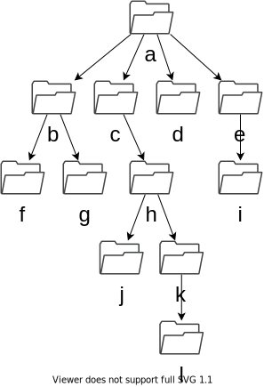

# Terminal

Commands to use:

| Command | Description                  | Example                                                                   |
|---------|------------------------------|---------------------------------------------------------------------------|
| `pwd`   | Present working directory    | `$ pwd`                                                                   |
| `ls`    | List contents                | `$ ls`                                                                    |
| `cd`    | Change directory             | `$ cd my-folder`   `$ cd path/to/folder`   `$ cd ../`   `$ cd ~` |
| `mkdir` | Make new directory           | `$ mkdir my-folder`                                                       |
| `rm`    | Remove files and directories | `$ rm -rf myfolder`   `$ rm -rf path/to/folder`                        |

Paths:

| Path                                                       | Description                                             |
|------------------------------------------------------------|---------------------------------------------------------|
| `.`                                                        | Current folder                                          |
| `~`                                                        | Home folder                                             |
| `..`                                                       | Parent folder                                           |
| `/`                                                        | Root folder                                             |
| `/absolute/path/to/folder`                                 | Absolute path: path to a folder from the root folder    |
| `relative/path/to/folder`   `./relative/path/to/folder` | Relative path: path to a folder from the current folder |

## Create Folder Structure

Create the following folder structure in the home folder.

### Folder Manipulation

1. What is the absolute path of folder `i`?

2. What is the relative path of folder `f` from the perspective of folder `a`?

3. Navigate to folder `g` and print its current location.

4. Now, navigate to folder `h` and print its current location.

5. Delete folder `l` and create it again in folder `j`.

6. Delete the entire folder structure.